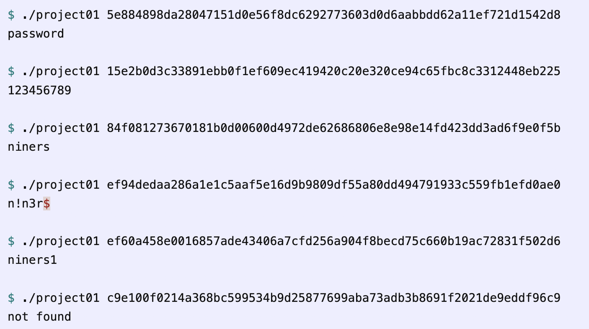

# Password-Cracker-Dictionary-Attack

## Background
Passwords are a fundamental part of computer security, and yet commonly reused. Once passwords are compromised from one website, hackers use the same password on other websites, aka Credential Stuffing.
This project implements Dictionary Attack. Hackers use Dictionay Attack to learn the actual passwords from stolen password files.

## Main outline
+ The program takes a hashed password (64 characters in length) on the command line.
+ It then compares the given hash with:
    1. The hash of each of a list of 10,000 common passwords
    2. The hash of each of the 10,000 passwords after substituting common “l33t speak” transformations like ‘e’ to ‘3’.
    3. The hash of each of the 10,000 passwords with a ‘1’ added to the end.
+ If the given hash matches any of those hashes, the program prints the clear-text password of the match. Otherwise, prints “not found”.

<p align="center">
  
</p>

## Additional Details
+ When you accept the assignment using the link above, your repo will contain the following given code:
    1. ```passwords.h``` and ```passwords.c``` which respectively declare and define the list of 10,000 common passwords
    2. ```sha256.h``` and ```sha256.c``` which respectively declare and define the code to compute a SHA-256 hash digest
    3. ```project01.c``` which shows how to use the SHA-256 functions.
+ Although there are a large number of l33t substitutions, these are some common ones:
    1. Change ‘o’ to ‘0’
    2. Change ‘e’ to ‘3’
    3. Change ‘i’ to ‘!’
    4. Change ‘a’ to ‘@’
    5. Change ‘h’ to ‘#’
    6. Change ‘s’ to ‘$’
    7. Change ‘t’ to ‘+’
